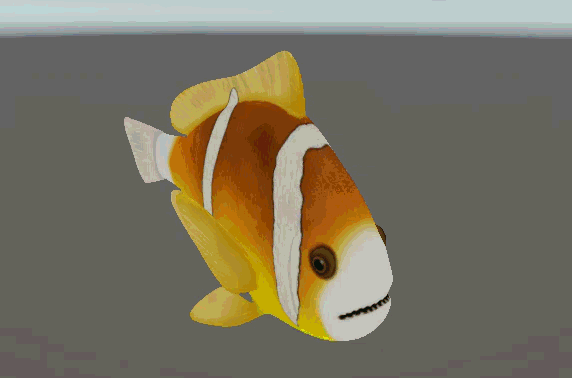

# fish

What started out as a Unity implementation of the techniques used for making the fish animate in ABZU, following Matt Nava's 2017 [GDC talk](https://youtu.be/l9NX06mvp2E) 
ended up as a project containing vertex animating, GPU instancing, Boid algorithm and spatial partitioning.

## fish.shader

The `fish.shader` file can be attached to any object you wish to animate, just like a standard shader.
`Notice:` Currently the shader assumes that the game objects up-vector is along the Y-axis, and that its forwards-vector is along the negative Z-axis.
If the game object is oriented any other way, the animations will look weird.

See the `Single Fish` scene for more.

## Single GPU Instancing

The `FishGPUInstance.shader` is used for GPU instancing. It is used together with the `FishGPUInstance.cs` script, the `Fish.compute` compute shader and a `BoidsSettingsOS` scriptable object.

### Setup

- - Create a new `material` that uses the `FishGPUInstance.shader`. 
- Create a `BoidsSettingsOS` scriptable objects in your Assets folder.
- Fill out the `BoidsSettingsOS` with your mesh, material and desired values.
- Add a empty gameobject to your scene.
- Add the `FishGPUInstance.cs` script to your empty gameobject.
- Drag-and-drop your `BoidsSettingsOS` into the `Settings` field.
- Drag-and-drop the `Fish.compute` into the `Compute Shader` field.

See the `Single Fish GPU Instance` scene for more.

## Multiple GPU Instancing

For more than one type of fish instances, you can use the `MultiFishManager.cs` script with the `Fish.compute` compute shader.

### Setup

- Create a new `material` that uses the `FishGPUInstance.shader`. 
- Create a `BoidsSettingsOS` scriptable objects in your Assets folder.
- Fill out the `BoidsSettingsOS` with your mesh, material and desired values.
- Repeat the above steps for as many fish as you want.
- Add a empty gameobject to your scene.
- Add the `MultiFishManager.cs` script to the empty gameobject.
- Drag-and-drop the `Fish.compute` into the `Compute Shader` field.
- Drag-and-drop your `BoidsSettingsOS`'s into the `Settings` field in the `Fish Type` list.

See `Demo` scene for more.

## License

MIT License

Copyright (c) 2025 Christoffer Bendig Mundbjerg-Sunne

Permission is hereby granted, free of charge, to any person obtaining a copy
of this software and associated documentation files (the "Software"), to deal
in the Software without restriction, including without limitation the rights
to use, copy, modify, merge, publish, distribute, sublicense, and/or sell
copies of the Software, and to permit persons to whom the Software is
furnished to do so, subject to the following conditions:

The above copyright notice and this permission notice shall be included in all
copies or substantial portions of the Software.

THE SOFTWARE IS PROVIDED "AS IS", WITHOUT WARRANTY OF ANY KIND, EXPRESS OR
IMPLIED, INCLUDING BUT NOT LIMITED TO THE WARRANTIES OF MERCHANTABILITY,
FITNESS FOR A PARTICULAR PURPOSE AND NONINFRINGEMENT. IN NO EVENT SHALL THE
AUTHORS OR COPYRIGHT HOLDERS BE LIABLE FOR ANY CLAIM, DAMAGES OR OTHER
LIABILITY, WHETHER IN AN ACTION OF CONTRACT, TORT OR OTHERWISE, ARISING FROM,
OUT OF OR IN CONNECTION WITH THE SOFTWARE OR THE USE OR OTHER DEALINGS IN THE
SOFTWARE.